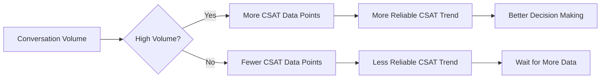

# Analytics Dashboard Walkthrough

## Overview

The Analytics Dashboard (`/analytics`) provides real-time insights into customer support conversations, agent performance, and support topics. It's built with React, TypeScript, and Recharts for data visualization.

## Page Structure

### 1. **Header Section**
- Title: "Analytics Dashboard"
- Subtitle: "Track customer satisfaction and support topics"
- Time Range Selector: Dropdown to filter data by:
  - Last 24 Hours
  - Last 7 Days (default)
  - Last 30 Days

### 2. **Overview Metrics Cards** (Top Row)

Four key performance indicators displayed as cards:

1. **Total Conversations**
   - Icon: MessageSquare
   - Shows: Count of conversations in selected time range
   - Data source: `ConversationAnalytics` table

2. **Average CSAT Score**
   - Icon: Star
   - Shows: Average customer satisfaction score out of 5
   - Format: "X.X/5" or "N/A" if no ratings
   - Data source: `ConversationAnalytics.csat_score` average

3. **Resolution Rate**
   - Icon: CheckCircle
   - Shows: Percentage of conversations marked as resolved
   - Format: "XX.X%"
   - Calculation: `(resolved_count / total_conversations) * 100`

4. **Volume Trend**
   - Icon: TrendingUp
   - Shows: Number of data points in volume trend chart
   - Subtitle: "Data points"

### 3. **Charts Row** (Middle Section)

Two side-by-side charts:

#### **Topic Distribution Pie Chart** (Left)
- **Component**: `TopicChart.tsx`
- **Visualization**: Recharts PieChart
- **Data**: Top support topics with counts
- **Features**:
  - Color-coded segments
  - Percentage labels on each segment
  - Legend showing topic names
- **Data Source**: `/api/analytics/topics` → `TopicAnalytics` aggregated by category

#### **CSAT Score Over Time** (Right)
- **Component**: `SatisfactionChart.tsx`
- **Visualization**: Recharts LineChart
- **Data**: Average CSAT score per day
- **Features**:
  - Line graph showing trends
  - Y-axis: 0-5 scale (CSAT range)
  - X-axis: Dates
  - Tooltip on hover showing exact values
- **Data Source**: `/api/analytics/satisfaction` → `ConversationAnalytics.csat_score` grouped by date

### 4. **Volume Trend Chart** (Full Width)

- **Component**: `TrendChart.tsx`
- **Visualization**: Recharts LineChart
- **Data**: Conversation count per day
- **Features**:
  - Line graph showing conversation volume over time
  - Y-axis: Conversation count
  - X-axis: Dates (formatted as "Month Day")
  - Title: "Conversation Volume Trend"
- **Data Source**: `/api/analytics/dashboard` → `ConversationAnalytics` grouped by date

### 5. **Satisfaction Breakdown** (Three Cards)

Additional metrics displayed as cards:

1. **Avg Response Time**
   - Shows: Average conversation duration in minutes
   - Format: "Xm" (e.g., "5m")
   - Subtitle: "Average conversation duration"
   - Data Source: `ConversationAnalytics.duration_seconds` average

2. **Resolved**
   - Shows: Count of resolved conversations
   - Subtitle: Resolution rate percentage
   - Format: "XX.X% resolution rate"

3. **Escalated**
   - Shows: Count of escalated conversations
   - Subtitle: Escalation rate percentage
   - Format: "XX.X% escalation rate"

### 6. **Top Support Topics List**

- **Component**: Embedded in main page
- **Display**: Numbered list of top 5 support topics
- **Format**:
  ```
  1. Topic Name                    Count
  2. Topic Name                    Count
  ...
  ```
- **Data Source**: `/api/analytics/dashboard` → `top_topics` array

### 7. **Conversation Statistics Table**

- **Component**: `ConversationStats.tsx`
- **Display**: Table showing recent conversations
- **Columns**:
  - Session ID
  - User Email
  - Started At
  - Duration
  - Message Count
  - Tool Count
  - CSAT Score
  - Status (Resolved/Escalated)
- **Data Source**: `/api/analytics/conversations` → List of `ConversationAnalytics`

### 8. **Empty State**

Displayed when no data is available:
- Icon: BarChart3
- Message: "No Data Available"
- Instructions: "Start having conversations with the support agent to see analytics data."

## Data Flow

### Real-Time Event Tracking

During chat conversations, the system automatically tracks:

1. **Conversation Start**
   - Triggered when WebSocket connection is established
   - Creates `ConversationAnalytics` record
   - Records: `session_id`, `user_email`, `started_at`

2. **Tool Usage**
   - Triggered when agent uses a tool (e.g., `get_order_status`, `search_books`)
   - Updates: `tool_count`, `tools_used` array
   - Creates `TopicAnalytics` record for the day
   - Maps tool to topic category:
     - `get_order_status` → "Order Status"
     - `initiate_return` → "Returns & Refunds"
     - `search_books` → "Product Information"
     - `get_policy_info` → "Policy Questions"
     - etc.

3. **Sentiment Analysis**
   - Triggered on each user message
   - Keyword-based analysis:
     - Positive: "thank", "great", "helpful", "excellent"
     - Negative: "frustrated", "problem", "issue", "wrong"
   - Updates: `ConversationAnalytics.sentiment_score` (weighted average)

4. **Conversation End**
   - Triggered when conversation closes
   - Updates: `ended_at`, `duration_seconds`, `resolved`, `escalated`

5. **CSAT Rating**
   - Triggered when user submits rating (1-5 stars)
   - Updates: `ConversationAnalytics.csat_score`
   - Creates `AnalyticsEvent` with rating data

### API Endpoints

The frontend makes parallel requests to load dashboard data:

```typescript
const [dashboard, satisfaction, topics, convs] = await Promise.all([
  analyticsApi.getDashboard(timeRange),      // GET /api/analytics/dashboard
  analyticsApi.getSatisfaction(timeRange),   // GET /api/analytics/satisfaction
  analyticsApi.getTopics(timeRange),         // GET /api/analytics/topics
  analyticsApi.getConversations(20, 0),     // GET /api/analytics/conversations
]);
```

### Backend Processing

Each endpoint performs SQL aggregations:

- **Dashboard**: Counts conversations, calculates averages, groups by date
- **Satisfaction**: Aggregates CSAT scores, sentiment, response times by date
- **Topics**: Groups tool usage by topic category, calculates success/escalation rates
- **Conversations**: Returns paginated list with filters (topic, user_email)

## Key Features

### 1. **Time Range Filtering**
- Changing the time range dropdown triggers a reload of all data
- All charts and metrics update to reflect the selected period
- Default: Last 7 days

### 2. **Responsive Design**
- Grid layout adapts to screen size:
  - Mobile: Single column
  - Tablet: 2 columns
  - Desktop: 4 columns for metrics, 2 columns for charts

### 3. **Loading States**
- Shows spinner and "Loading analytics..." message while fetching
- Prevents interaction during data load

### 4. **Error Handling**
- Errors logged to console
- Graceful degradation (shows "N/A" or 0 for missing data)

## Database Schema

### `analytics_events`
- Individual event records
- Fields: `event_type`, `session_id`, `user_email`, `timestamp`, `event_metadata` (JSON)

### `conversation_analytics`
- Aggregated per-conversation metrics
- Fields: `session_id`, `user_email`, `started_at`, `ended_at`, `message_count`, `tool_count`, `tools_used`, `sentiment_score`, `csat_score`, `resolved`, `escalated`, `duration_seconds`

### `topic_analytics`
- Daily aggregated topic statistics
- Fields: `topic_category`, `date`, `count`, `success_rate`, `escalation_rate`

## Usage Example

1. **Navigate to Analytics**: Click "Analytics" in navigation menu or visit `/analytics`

2. **View Overview**: See key metrics at a glance (conversations, CSAT, resolution rate)

3. **Analyze Trends**: 
   - Check CSAT trend chart to see if satisfaction is improving
   - Review volume trend to identify busy periods
   - Examine topic distribution to understand common support needs

4. **Drill Down**: 
   - Click on conversation stats table to see individual conversation details
   - Filter by time range to compare periods
   - Review top topics to prioritize training/resources

5. **Take Action**:
   - If CSAT is low → Review sentiment scores and conversation details
   - If escalation rate is high → Focus on topic categories with high escalation
   - If response time is long → Investigate conversations with long duration

## Understanding Traffic and CSAT Relationship

### How Conversation Volume Affects CSAT Analysis

The **CSAT Score Over Time** chart is the primary widget for tracking customer satisfaction trends. Understanding how traffic volume relates to CSAT scores is crucial for meaningful analysis:

#### 1. **Statistical Significance**
- **Low Volume Periods**: With few conversations, CSAT scores can be volatile and less reliable
  - Example: 1 conversation with a 5-star rating = 100% CSAT, but not statistically meaningful
  - Solution: The chart aggregates daily averages, smoothing out single-conversation spikes
  
- **High Volume Periods**: More conversations provide more reliable CSAT trends
  - Example: 50 conversations averaging 4.2 stars = more trustworthy metric
  - The dashboard shows conversation volume alongside CSAT to provide context

#### 2. **Traffic Patterns and CSAT Correlation**

The relationship between traffic and CSAT reveals important insights:



**Key Patterns to Watch:**

- **Peak Traffic + High CSAT**: Indicates the agent handles volume well
- **Peak Traffic + Low CSAT**: May indicate agent overload or quality issues
- **Low Traffic + High CSAT**: Could be selection bias (only satisfied customers rate)
- **Low Traffic + Low CSAT**: Small sample size - investigate individual conversations

#### 3. **CSAT Collection Rate**

Not all conversations receive CSAT ratings:
- **Collection Rate**: ~70% of resolved conversations receive ratings
- **Bias**: Customers with negative experiences may be less likely to rate
- **Impact**: Low volume periods may have incomplete CSAT data

**Best Practices:**
- Monitor both **Conversation Volume Trend** and **CSAT Score Over Time** together
- Look for periods with sufficient volume (10+ conversations/day) for reliable CSAT analysis
- Use the "Last 30 Days" view to see longer-term trends when daily volume is low

#### 4. **Interpreting the CSAT Chart**

The **CSAT Score Over Time** chart shows:
- **Daily Average CSAT**: Each point represents the average rating for that day
- **Trend Line**: Connect the dots to see if satisfaction is improving or declining
- **Y-Axis Range**: 0-5 scale (standard CSAT range)

**What to Look For:**
- **Upward Trend**: Satisfaction improving over time
- **Downward Trend**: Satisfaction declining (investigate recent changes)
- **Flat Line**: Consistent satisfaction (good for stability)
- **Volatility**: Large day-to-day swings may indicate:
  - Low volume (few ratings per day)
  - Inconsistent service quality
  - Different customer segments on different days

#### 5. **Traffic Generation for Analytics**

To generate meaningful analytics data:

```bash
# Generate demo analytics data (no API calls)
docker-compose exec backend python -m data.seed_analytics --days 30 --per-day 20

# This creates:
# - 30 days of historical data
# - ~20 conversations per day
# - Realistic CSAT scores correlated with sentiment
# - Various topics and resolution outcomes
```

**Why Volume Matters:**
- **Minimum Threshold**: At least 10-15 conversations per day for reliable daily CSAT averages
- **Optimal Range**: 20-50 conversations per day provides excellent statistical power
- **Trend Detection**: More data points make it easier to identify real trends vs. noise

#### 6. **CSAT Calculation**

CSAT scores are calculated as:
- **Per Conversation**: Individual rating (1-5 stars) submitted by customer
- **Daily Average**: `SUM(csat_scores) / COUNT(rated_conversations)` for each day
- **Time Range Average**: Overall average across selected time period

**Data Flow:**
1. Customer completes conversation
2. If resolved, customer is prompted for rating (70% response rate)
3. Rating stored in `ConversationAnalytics.csat_score`
4. Dashboard aggregates by date for trend visualization

#### 7. **Actionable Insights**

When analyzing CSAT with traffic context:

**High Volume + Declining CSAT:**
- Investigate recent agent changes or system updates
- Review sentiment scores for negative patterns
- Check escalation rates (may indicate unresolved issues)

**Low Volume + High CSAT:**
- May indicate satisfied customers are more likely to engage
- Consider proactive outreach to increase engagement
- Monitor if CSAT drops as volume increases

**Consistent Volume + Improving CSAT:**
- Agent performance is improving
- System optimizations are working
- Continue current practices

## Technical Stack

- **Frontend Framework**: React 18 + TypeScript
- **State Management**: React hooks (useState, useEffect)
- **Charts**: Recharts 2.15.4
- **API Client**: Axios (via `analyticsApi` service)
- **Styling**: Tailwind CSS
- **Icons**: Lucide React

## Files Reference

- **Page Component**: `frontend/src/pages/AnalyticsDashboardPage.tsx`
- **API Service**: `frontend/src/services/analytics.ts`
- **Chart Components**: 
  - `frontend/src/components/analytics/TopicChart.tsx`
  - `frontend/src/components/analytics/SatisfactionChart.tsx`
  - `frontend/src/components/analytics/TrendChart.tsx`
  - `frontend/src/components/analytics/MetricCard.tsx`
  - `frontend/src/components/analytics/ConversationStats.tsx`
- **Backend API**: `backend/api/analytics.py`
- **Event Tracking**: `backend/analytics/event_collector.py`
- **Database Models**: `backend/data/models.py` (AnalyticsEvent, ConversationAnalytics, TopicAnalytics)
