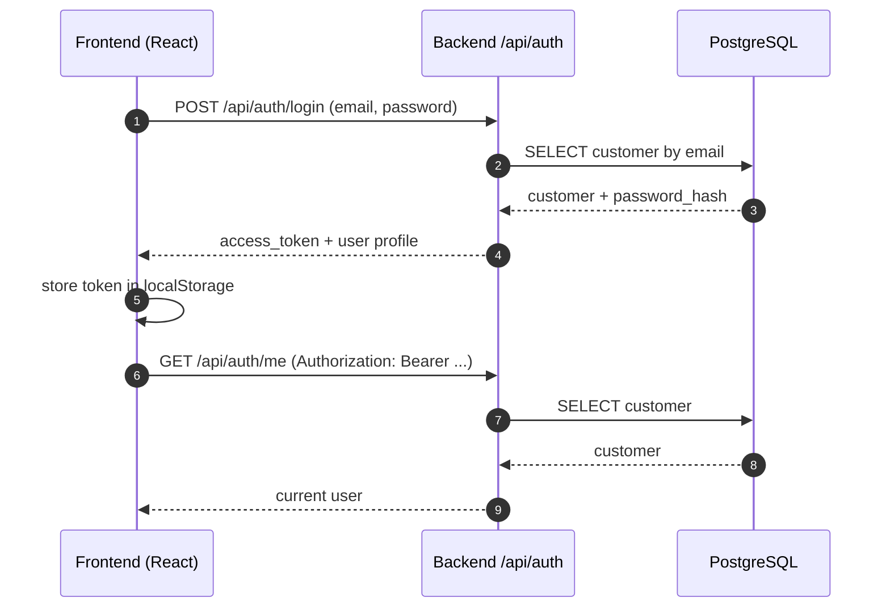
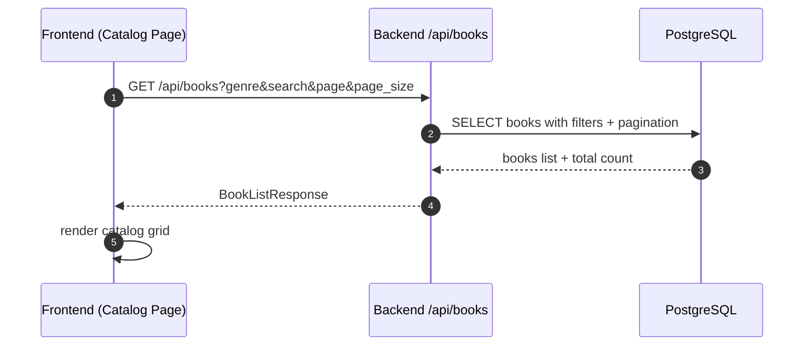
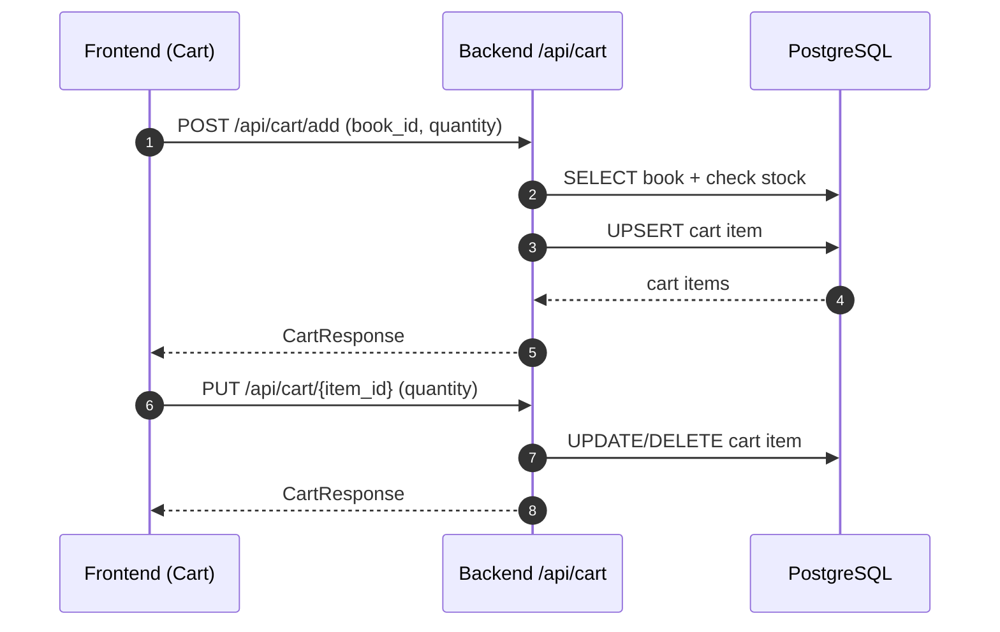
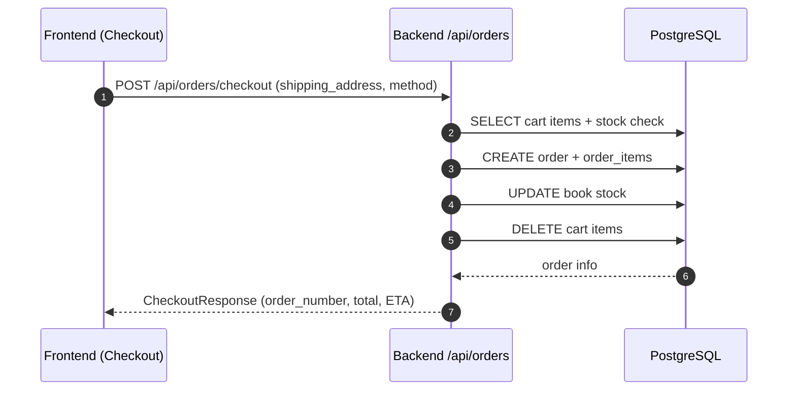
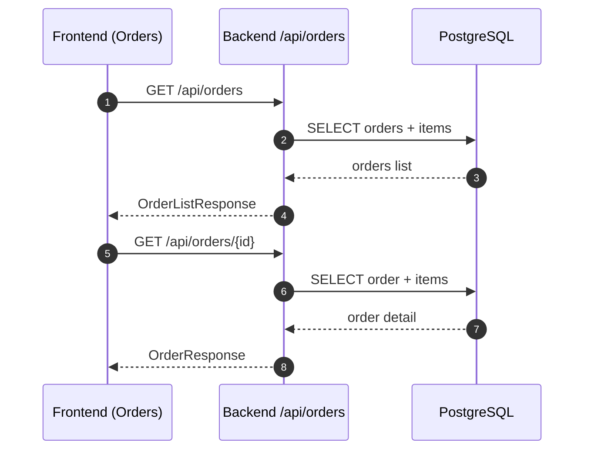
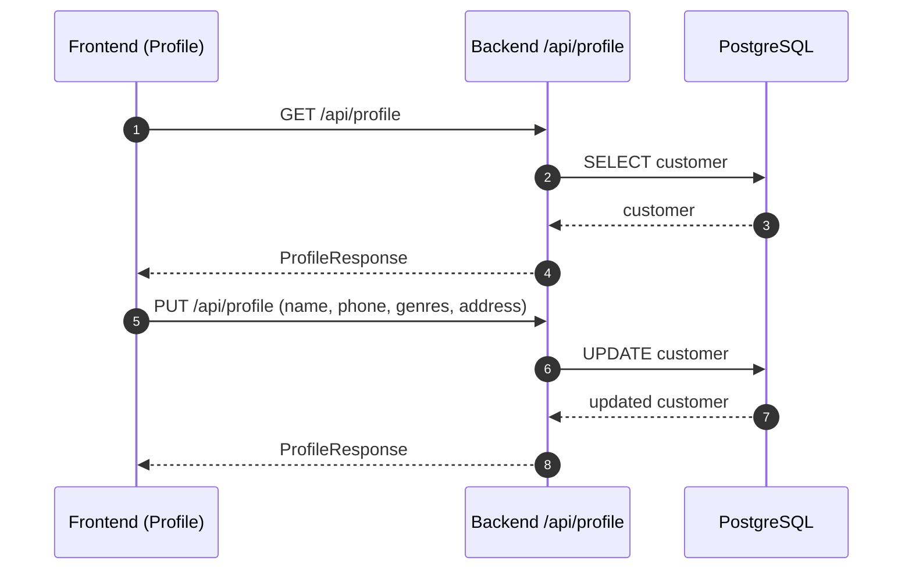
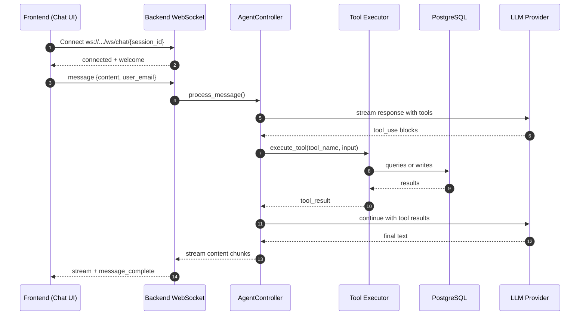
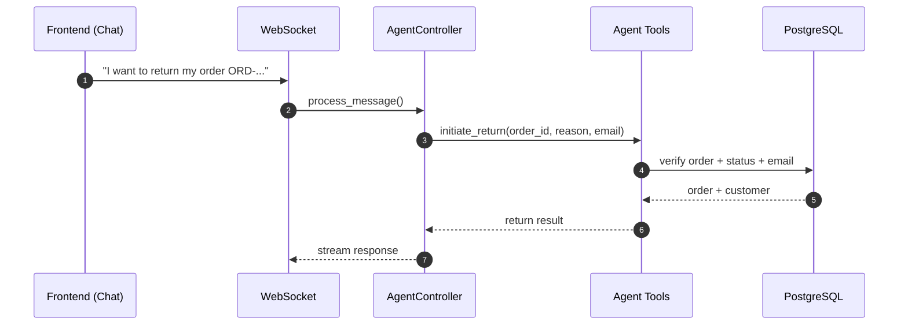
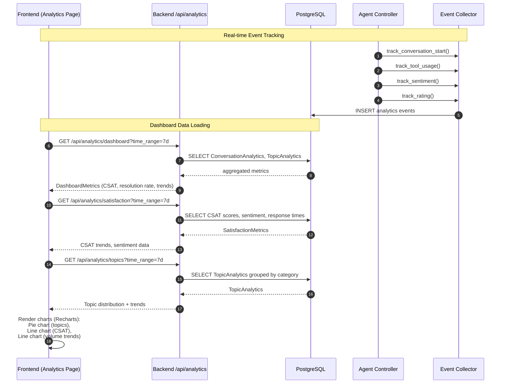
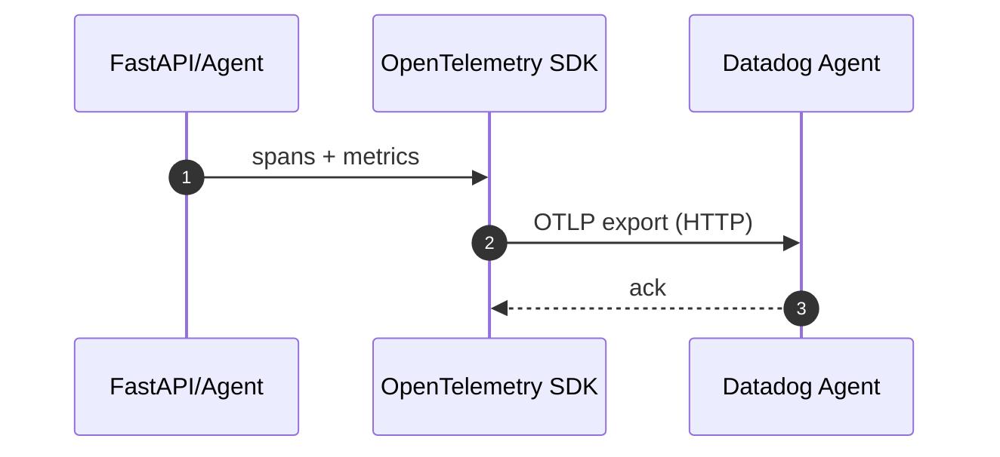

## Architecture Overview

> **Note:** If Mermaid diagrams are not rendering in your Markdown preview, open [`architecture_overview.html`](./architecture_overview.html) in your browser for a fully rendered view.

This diagram captures the major components and integration points of Bookly,
including REST, WebSocket chat, AI providers, database, and telemetry.

```mermaid
flowchart LR
  subgraph Frontend[Frontend - React + Vite]
    FE_Router[App Router]
    FE_Pages[Pages\nCatalog, Cart, Orders, Profile, Support, Analytics]
    FE_Stores[Zustand Stores\nAuth, Cart, Chat]
    FE_Api[REST Client\nfrontend/src/services/api.ts]
    FE_WS[WebSocket Client\nfrontend/src/store/chatStore.ts]
    FE_Analytics[Analytics Components\nCharts, Metrics, Stats]
  end

  subgraph Backend[Backend - FastAPI]
    BE_App[FastAPI App\nbackend/main.py]
    BE_Auth[Auth API\n/api/auth]
    BE_Books[Books API\n/api/books]
    BE_Cart[Cart API\n/api/cart]
    BE_Orders[Orders API\n/api/orders]
    BE_Profile[Profile API\n/api/profile]
    BE_Analytics[Analytics API\n/api/analytics]
    BE_WS[WebSocket\n/ws/chat/{session_id}]
    BE_Agent[Agent Controller\nbackend/agent/controller.py]
    BE_Tools[Agent Tools\nbackend/agent/tools.py]
    BE_EventCollector[Event Collector\nbackend/analytics/event_collector.py]
  end

  subgraph Data[Data Layer]
    DB[(PostgreSQL)]
    Models[SQLAlchemy Models\nbackend/data/models.py]
    Seed[Seed Data\nbackend/data/seed_*.py]
    AnalyticsModels[Analytics Models\nAnalyticsEvent, ConversationAnalytics, TopicAnalytics]
  end

  subgraph LLMs[LLM Providers]
    Claude[Anthropic Claude\nANTHROPIC_API_KEY]
    OpenAI[OpenAI GPT\nOPENAI_API_KEY]
  end

  subgraph Telemetry[Observability]
    OTel[OpenTelemetry SDK\nbackend/telemetry/*]
    DD[Datadog Agent\nOTLP Exporter]
  end

  FE_Router --> FE_Pages
  FE_Pages --> FE_Stores
  FE_Pages --> FE_Analytics
  FE_Stores --> FE_Api
  FE_Stores --> FE_WS
  FE_Analytics --> FE_Api

  FE_Api -->|HTTP REST| BE_App
  FE_WS -->|WebSocket| BE_WS

  BE_App --> BE_Auth
  BE_App --> BE_Books
  BE_App --> BE_Cart
  BE_App --> BE_Orders
  BE_App --> BE_Profile
  BE_App --> BE_Analytics
  BE_WS --> BE_Agent
  BE_Agent --> BE_Tools
  BE_Agent --> BE_EventCollector
  BE_EventCollector --> AnalyticsModels

  BE_Auth --> Models
  BE_Books --> Models
  BE_Cart --> Models
  BE_Orders --> Models
  BE_Profile --> Models
  BE_Tools --> Models
  BE_Analytics --> AnalyticsModels

  Models --> DB
  AnalyticsModels --> DB
  Seed --> DB

  BE_Agent --> Claude
  BE_Agent --> OpenAI

  BE_App --> OTel
  BE_Agent --> OTel
  OTel --> DD
```

## Core Flows

### 1) Authentication (Login + JWT)


### 2) Browse Catalog (Books + Filters)


### 3) Cart Management


### 4) Checkout → Order Creation


### 5) Order History + Detail


### 6) Profile Updates


### 7) Support Chat (WebSocket + Agent Tool Loop)


### 8) Agent Return Flow (Tool‑Based)


### 9) Analytics Dashboard (Metrics + Charts)


### 10) Telemetry (Tracing + Metrics)


## Analytics System Overview

The Analytics Dashboard provides real-time insights into customer support conversations, agent performance, and support topics. Here's how it works:

### **Data Collection Flow**

1. **Event Tracking**: During chat conversations, the Agent Controller automatically tracks:
   - **Conversation lifecycle**: Start/end times, duration
   - **Tool usage**: Which tools were used (order lookup, book search, returns, etc.)
   - **Sentiment analysis**: Keyword-based sentiment detection from user messages
   - **CSAT ratings**: Customer satisfaction scores (1-5) submitted after conversations
   - **Topic categorization**: Automatic mapping of tools to support topics (Order Status, Returns, Product Info, etc.)

2. **Data Storage**: Events are stored in PostgreSQL:
   - `analytics_events`: Individual event records with metadata
   - `conversation_analytics`: Aggregated conversation metrics (CSAT, sentiment, tool usage)
   - `topic_analytics`: Daily aggregated topic statistics (count, success rate, escalation rate)

### **Dashboard Features**

The Analytics Dashboard (`/analytics`) displays:

1. **Overview Metrics Cards**:
   - Total Conversations
   - Average CSAT Score (out of 5)
   - Resolution Rate (%)
   - Volume Trend data points

2. **Interactive Charts** (using Recharts):
   - **Topic Distribution Pie Chart**: Shows support topics breakdown
   - **CSAT Score Over Time**: Line chart showing satisfaction trends
   - **Conversation Volume Trend**: Line chart showing conversation count over time

3. **Detailed Metrics**:
   - Average response time (conversation duration)
   - Resolution breakdown (resolved vs escalated)
   - Top 5 support topics list
   - Recent conversation statistics

4. **Time Range Filtering**: 
   - Last 24 hours
   - Last 7 days (default)
   - Last 30 days

### **Key Components**

- **Frontend**: `frontend/src/pages/AnalyticsDashboardPage.tsx`
  - Uses Recharts for visualization (PieChart, LineChart)
  - Fetches data via `analyticsApi` service
  - Responsive grid layout with metric cards

- **Backend API**: `backend/api/analytics.py`
  - `/api/analytics/dashboard` - Overall metrics
  - `/api/analytics/satisfaction` - CSAT and sentiment data
  - `/api/analytics/topics` - Topic distribution and trends
  - `/api/analytics/conversations` - Conversation list
  - `/api/analytics/trends` - Time-series trends
  - `/api/analytics/rating` - Submit CSAT ratings

- **Event Collector**: `backend/analytics/event_collector.py`
  - `track_conversation_start()` - Initialize conversation tracking
  - `track_conversation_end()` - Finalize with resolution status
  - `track_tool_usage()` - Record tool calls and update topic analytics
  - `track_sentiment()` - Analyze sentiment from messages
  - `track_rating()` - Store CSAT scores

- **Database Models**: `backend/data/models.py`
  - `AnalyticsEvent` - Individual event records
  - `ConversationAnalytics` - Per-conversation aggregated metrics
  - `TopicAnalytics` - Daily topic statistics

## Integration Point Index
- REST: `frontend/src/services/api.ts` ⇄ `backend/api/*.py`
- WebSocket: `frontend/src/store/chatStore.ts` ⇄ `backend/api/websocket.py`
- Agent: `backend/agent/controller.py`, `backend/agent/tools.py`, `backend/agent/prompts.py`
- Analytics: `frontend/src/services/analytics.ts` ⇄ `backend/api/analytics.py`, `backend/analytics/event_collector.py`
- DB: `backend/data/database.py`, `backend/data/models.py`, `backend/data/seed_*.py`
- Telemetry: `backend/telemetry/*`, `docker-compose.yml` (datadog-agent)
