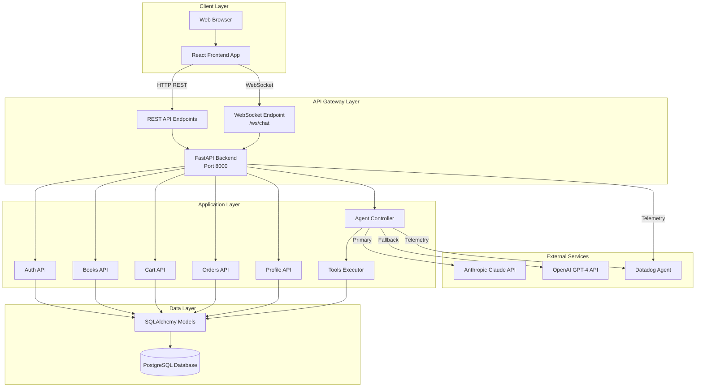
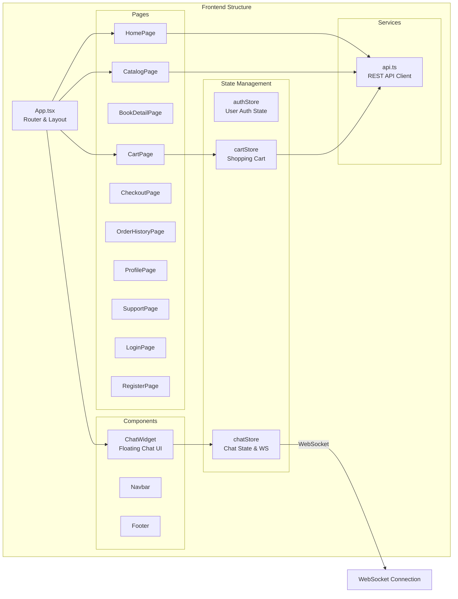
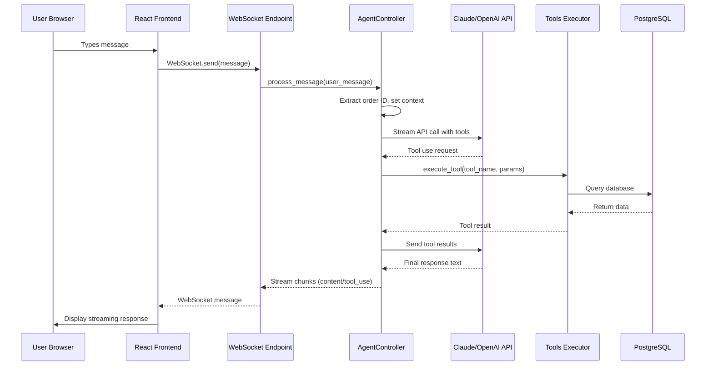
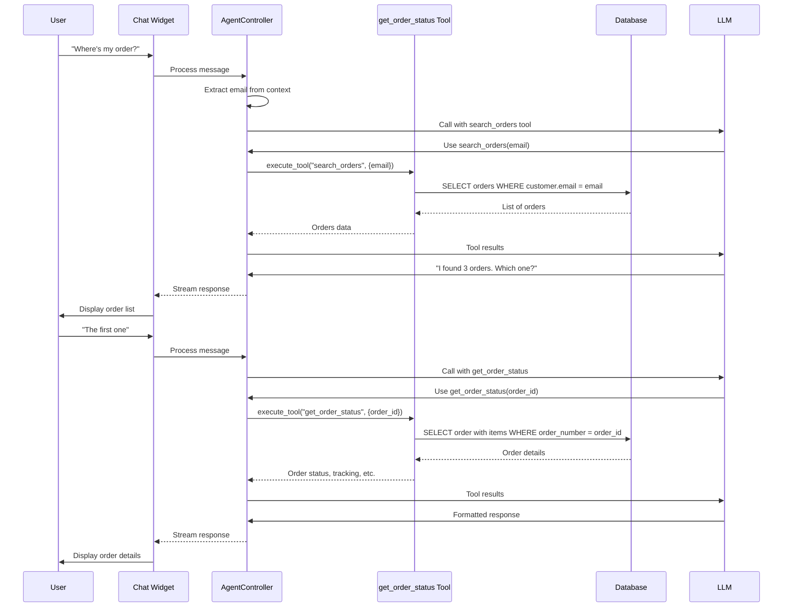
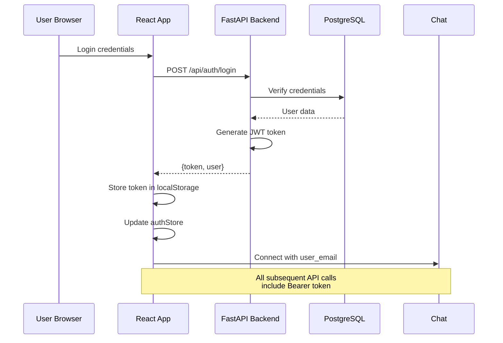
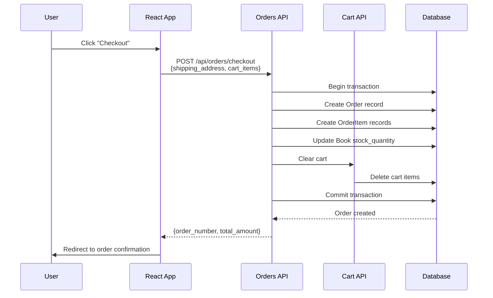
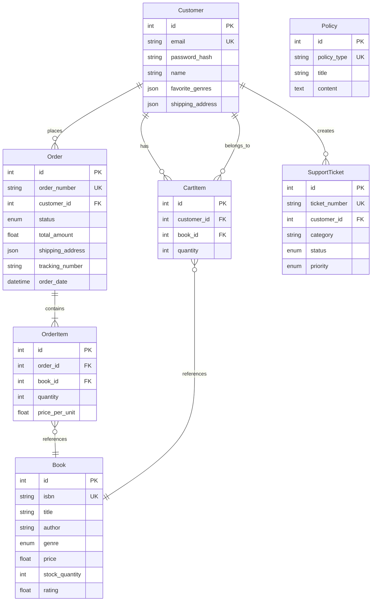

# BooklyAgent Codebase Overview

## Executive Summary

**BooklyAgent** is a full-stack online bookstore application with an AI-powered customer support agent. The system provides a complete e-commerce experience with intelligent chat support that can handle order inquiries, returns, recommendations, and general customer service tasks.

### Key Features
- **E-commerce Platform**: Book browsing, shopping cart, checkout, and order management
- **AI Customer Support**: Real-time chat agent powered by Claude (Anthropic) with OpenAI fallback
- **User Authentication**: JWT-based authentication with user profiles
- **Order Management**: Order tracking, status updates, and return processing
- **Personalized Recommendations**: AI-driven book suggestions based on user preferences
- **Telemetry & Observability**: OpenTelemetry integration with Datadog for monitoring

---

## Technology Stack

### Frontend
- **Framework**: React 18 with TypeScript
- **Build Tool**: Vite
- **Styling**: Tailwind CSS
- **State Management**: Zustand
- **Routing**: React Router v6
- **HTTP Client**: Axios
- **WebSocket**: Native WebSocket API

### Backend
- **Framework**: FastAPI (Python 3.11+)
- **Database**: PostgreSQL with SQLAlchemy (async)
- **AI Provider**: Anthropic Claude (primary), OpenAI GPT-4 (fallback)
- **Authentication**: JWT tokens
- **Observability**: OpenTelemetry → Datadog
- **WebSocket**: FastAPI WebSocket support

### Infrastructure
- **Containerization**: Docker & Docker Compose
- **Database**: PostgreSQL 15
- **Monitoring**: Datadog Agent (APM, Logs, Metrics)

---

## System Architecture

### High-Level Architecture



---

## Core Components

### Frontend Components



### Backend Components

```mermaid
graph TB
    subgraph "Backend Structure"
        Main[main.py<br/>FastAPI App Entry]
        
        subgraph "API Routes"
            AuthRoute[/api/auth]
            BooksRoute[/api/books]
            CartRoute[/api/cart]
            OrdersRoute[/api/orders]
            ProfileRoute[/api/profile]
            WSRoute[/ws/chat]
        end
        
        subgraph "Agent System"
            Controller[AgentController<br/>Orchestrates AI Agent]
            Prompts[prompts.py<br/>System Prompts]
            Tools[tools.py<br/>Tool Definitions & Execution]
        end
        
        subgraph "Data Layer"
            Models[models.py<br/>SQLAlchemy Models]
            Database[database.py<br/>DB Connection & Setup]
        end
        
        subgraph "State Management"
            SessionMgr[session_manager.py<br/>Chat Session State]
        end
        
        subgraph "Telemetry"
            Telemetry[telemetry/<br/>OpenTelemetry Integration]
        end
    end
    
    Main --> AuthRoute
    Main --> BooksRoute
    Main --> CartRoute
    Main --> OrdersRoute
    Main --> ProfileRoute
    Main --> WSRoute
    
    WSRoute --> Controller
    Controller --> Prompts
    Controller --> Tools
    Controller --> SessionMgr
    
    AuthRoute --> Models
    BooksRoute --> Models
    CartRoute --> Models
    OrdersRoute --> Models
    ProfileRoute --> Models
    Tools --> Models
    
    Models --> Database
    
    Controller --> Telemetry
    Main --> Telemetry
```

---

## Data Flow Diagrams

### Chat Message Flow



### Order Lookup Flow



### Authentication Flow



### Checkout Flow



---

## Database Schema



---

## Integration Points

### 1. Frontend ↔ Backend REST API

**Protocol**: HTTP/HTTPS  
**Format**: JSON  
**Authentication**: JWT Bearer Token

**Endpoints**:
- `/api/auth/*` - Authentication (login, register, profile)
- `/api/books/*` - Book catalog and search
- `/api/cart/*` - Shopping cart operations
- `/api/orders/*` - Order management and checkout
- `/api/profile/*` - User profile management

**Integration Pattern**:
```typescript
// Frontend: src/services/api.ts
const api = axios.create({
  baseURL: `${API_URL}/api`,
  headers: { 'Content-Type': 'application/json' }
});

// Auto-inject JWT token
api.interceptors.request.use((config) => {
  const token = localStorage.getItem('token');
  if (token) {
    config.headers.Authorization = `Bearer ${token}`;
  }
  return config;
});
```

### 2. Frontend ↔ Backend WebSocket

**Protocol**: WebSocket (ws:// or wss://)  
**Format**: JSON messages  
**Purpose**: Real-time chat communication

**Message Types**:
- `connected` - Connection established
- `message` - User message to agent
- `stream` - Streaming response chunks
- `tool_use` - Tool execution indicator
- `message_complete` - Response finished
- `typing` - Typing indicator
- `error` - Error message

**Integration Pattern**:
```typescript
// Frontend: src/store/chatStore.ts
const ws = new WebSocket(`${WS_URL}/ws/chat/${sessionId}`);
ws.send(JSON.stringify({
  type: 'message',
  content: userMessage,
  user_email: userEmail
}));
```

### 3. Backend ↔ AI Provider (Claude/OpenAI)

**Protocol**: HTTPS  
**Format**: JSON (Anthropic SDK / OpenAI SDK)  
**Pattern**: Primary/fallback architecture

**Flow**:
1. Try Anthropic Claude first
2. On error (billing, rate limit, API error), fallback to OpenAI
3. Maintain conversation history across providers
4. Stream responses for better UX

**Integration Pattern**:
```python
# Backend: backend/agent/controller.py
if self.anthropic_client and self.active_provider == "anthropic":
    try:
        async for chunk in self._process_with_anthropic(...):
            yield chunk
    except anthropic.APIError as e:
        if self._should_fallback_to_openai(e):
            self.active_provider = "openai"
            # Fallback to OpenAI...
```

### 4. Backend ↔ Database

**Protocol**: PostgreSQL async protocol  
**ORM**: SQLAlchemy (async)  
**Connection Pool**: AsyncSessionLocal

**Pattern**: Async/await throughout, connection per request

**Integration Pattern**:
```python
# Backend: backend/data/database.py
async with AsyncSessionLocal() as session:
    result = await session.execute(select(Order).where(...))
    order = result.scalar_one_or_none()
```

### 5. Backend ↔ Telemetry (Datadog)

**Protocol**: OTLP over HTTP/gRPC  
**Format**: OpenTelemetry Protocol  
**Destination**: Datadog Agent (local) → Datadog Cloud

**Telemetry Types**:
- **Traces**: Request spans, tool execution spans, LLM call spans
- **Metrics**: Message counts, response latency, token usage
- **Logs**: Conversation logs, errors, debug info

**Integration Pattern**:
```python
# Backend: backend/telemetry/agent_instrumentation.py
from opentelemetry import trace
tracer = trace.get_tracer(__name__)

with tracer.start_as_current_span("agent.process_message") as span:
    span.set_attribute("session.id", session_id)
    # ... agent processing ...
```

---

## Key Design Patterns

### 1. Agent Tool Pattern

The AI agent uses a **tool-calling pattern** where:
- LLM receives tool definitions
- LLM decides which tools to call
- Backend executes tools with database access
- Results fed back to LLM
- LLM generates final response

**Tools Available**:
- `get_order_status` - Look up order details
- `search_orders` - Find orders by email
- `get_customer_info` - Get user profile
- `initiate_return` - Process returns
- `get_policy_info` - Retrieve policies
- `get_recommendations` - Personalized book suggestions
- `search_books` - Search catalog
- `create_support_ticket` - Escalate to human

### 2. Session Management Pattern

- Each WebSocket connection has a unique `session_id`
- Agent controller maintains conversation history per session
- User context (email) can be updated, resetting conversation if user changes
- Session state persists for the lifetime of WebSocket connection

### 3. Streaming Response Pattern

- Agent streams responses chunk-by-chunk for better UX
- Frontend accumulates chunks into complete messages
- Tool execution indicators shown to user
- Typing indicators during processing

### 4. Fallback Pattern

- Primary: Anthropic Claude
- Fallback: OpenAI GPT-4
- Automatic switching on errors
- Conversation history maintained across switches

---

## File Structure

```
BooklyAgent/
├── backend/
│   ├── agent/              # AI agent logic
│   │   ├── controller.py    # Main agent orchestrator
│   │   ├── prompts.py       # System prompts
│   │   └── tools.py         # Tool definitions & execution
│   ├── api/                 # FastAPI route handlers
│   │   ├── auth.py          # Authentication endpoints
│   │   ├── books.py         # Book catalog endpoints
│   │   ├── cart.py          # Shopping cart endpoints
│   │   ├── orders.py        # Order management endpoints
│   │   ├── profile.py       # User profile endpoints
│   │   └── websocket.py     # WebSocket chat endpoint
│   ├── data/                # Database layer
│   │   ├── models.py        # SQLAlchemy models
│   │   ├── database.py      # DB connection & setup
│   │   └── seed_*.py        # Data seeding scripts
│   ├── state/               # State management
│   │   └── session_manager.py  # Chat session state
│   ├── telemetry/           # Observability
│   │   ├── config.py        # OpenTelemetry setup
│   │   └── agent_instrumentation.py  # Agent tracing
│   ├── main.py              # FastAPI app entry point
│   └── requirements.txt     # Python dependencies
│
├── frontend/
│   ├── src/
│   │   ├── components/      # React components
│   │   │   ├── chat/        # Chat widget
│   │   │   └── layout/      # Layout components
│   │   ├── pages/           # Page components
│   │   ├── store/           # Zustand stores
│   │   │   ├── authStore.ts
│   │   │   ├── cartStore.ts
│   │   │   └── chatStore.ts
│   │   ├── services/        # API client
│   │   │   └── api.ts
│   │   ├── types/           # TypeScript types
│   │   │   └── index.ts
│   │   ├── App.tsx          # Main app component
│   │   └── main.tsx         # Entry point
│   └── package.json
│
├── docs/                    # Documentation
│   ├── architecture/        # Architecture docs
│   ├── design_document.md   # Agent design details
│   └── codebase_overview.md # This file
│
└── docker-compose.yml       # Docker orchestration
```

---

## Environment Variables

### Backend
- `DATABASE_URL` - PostgreSQL connection string
- `ANTHROPIC_API_KEY` - Anthropic API key (required)
- `OPENAI_API_KEY` - OpenAI API key (optional, for fallback)
- `JWT_SECRET` - Secret for JWT token signing
- `CORS_ORIGINS` - Allowed CORS origins
- `ENVIRONMENT` - Environment name (development/production)
- `OTEL_EXPORTER_OTLP_ENDPOINT` - OpenTelemetry endpoint

### Frontend
- `VITE_API_URL` - Backend API URL
- `VITE_WS_URL` - WebSocket URL (optional, auto-detected in dev)

### Datadog (Optional)
- `DD_API_KEY` - Datadog API key
- `DD_SITE` - Datadog site (default: datadoghq.com)

---

## Development Workflow

### Starting the Application

```bash
# Start all services
docker-compose up --build

# Services available at:
# - Frontend: http://localhost:5173
# - Backend API: http://localhost:8000
# - API Docs: http://localhost:8000/docs
# - PostgreSQL: localhost:5432
```

### Development Mode

- **Backend**: Hot reload enabled (`--reload` flag)
- **Frontend**: Vite dev server with HMR
- **Database**: Persistent volume, seeded on startup

### Testing the Chat Agent

1. Start the application
2. Navigate to any page (chat widget available globally)
3. Click chat widget to open
4. Try queries like:
   - "Where's my order?"
   - "Can you recommend a book?"
   - "What's your return policy?"
   - "I want to return order ORD-2024-00001"

---

## Security Considerations

1. **Authentication**: JWT tokens stored in localStorage (consider httpOnly cookies for production)
2. **Authorization**: User-scoped data access (orders, cart, profile)
3. **API Keys**: Environment variables, never committed
4. **CORS**: Configured for specific origins
5. **SQL Injection**: Protected by SQLAlchemy ORM
6. **XSS**: React escapes by default, but validate user inputs

---

## Performance Considerations

1. **Database**: Async SQLAlchemy for non-blocking I/O
2. **Streaming**: Agent responses streamed for perceived performance
3. **Connection Pooling**: Database connection pooling via SQLAlchemy
4. **Caching**: Consider Redis for frequently accessed data (not implemented)
5. **CDN**: Frontend assets could be served via CDN in production

---

## Future Enhancements

1. **Redis Caching**: Cache book catalog, user sessions
2. **Message Queue**: Background job processing (email notifications, etc.)
3. **File Storage**: S3-compatible storage for book cover images
4. **Payment Integration**: Stripe/PayPal for checkout
5. **Email Service**: SendGrid/AWS SES for transactional emails
6. **Analytics**: User behavior tracking, conversion funnels
7. **Multi-language**: i18n support for internationalization

---

## Troubleshooting

### Chat not connecting
- Check WebSocket URL configuration
- Verify backend is running on port 8000
- Check browser console for WebSocket errors

### Agent not responding
- Verify `ANTHROPIC_API_KEY` is set
- Check backend logs for API errors
- Verify database connection

### Database errors
- Ensure PostgreSQL container is healthy
- Check `DATABASE_URL` environment variable
- Verify database migrations/seeding completed

---

## Contributing

When adding new features:

1. **Backend**: Add routes in `backend/api/`, models in `backend/data/models.py`
2. **Frontend**: Add pages in `frontend/src/pages/`, components in `frontend/src/components/`
3. **Agent Tools**: Add tool definitions in `backend/agent/tools.py`
4. **Types**: Update `frontend/src/types/index.ts` for TypeScript types
5. **Documentation**: Update this file and relevant docs

---

## References

- [FastAPI Documentation](https://fastapi.tiangolo.com/)
- [React Documentation](https://react.dev/)
- [Anthropic Claude API](https://docs.anthropic.com/)
- [OpenTelemetry](https://opentelemetry.io/)
- [SQLAlchemy Async](https://docs.sqlalchemy.org/en/20/orm/extensions/asyncio.html)
